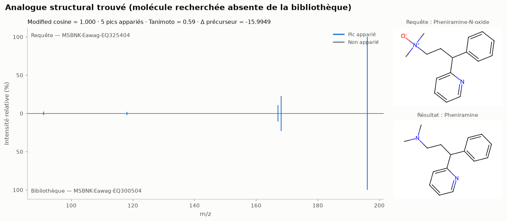
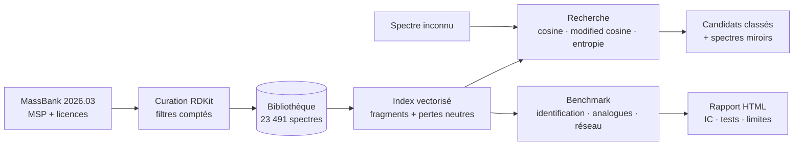
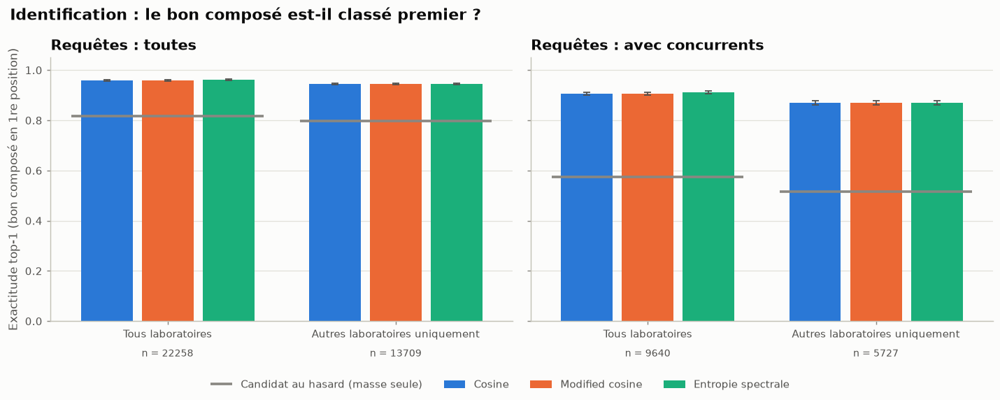
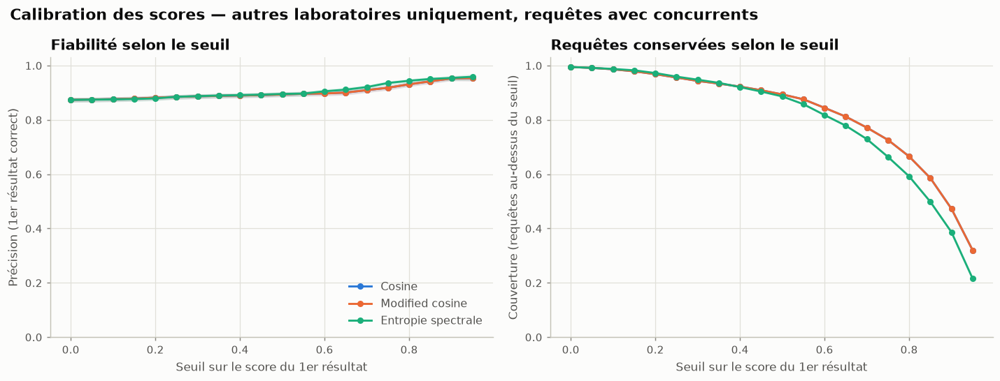
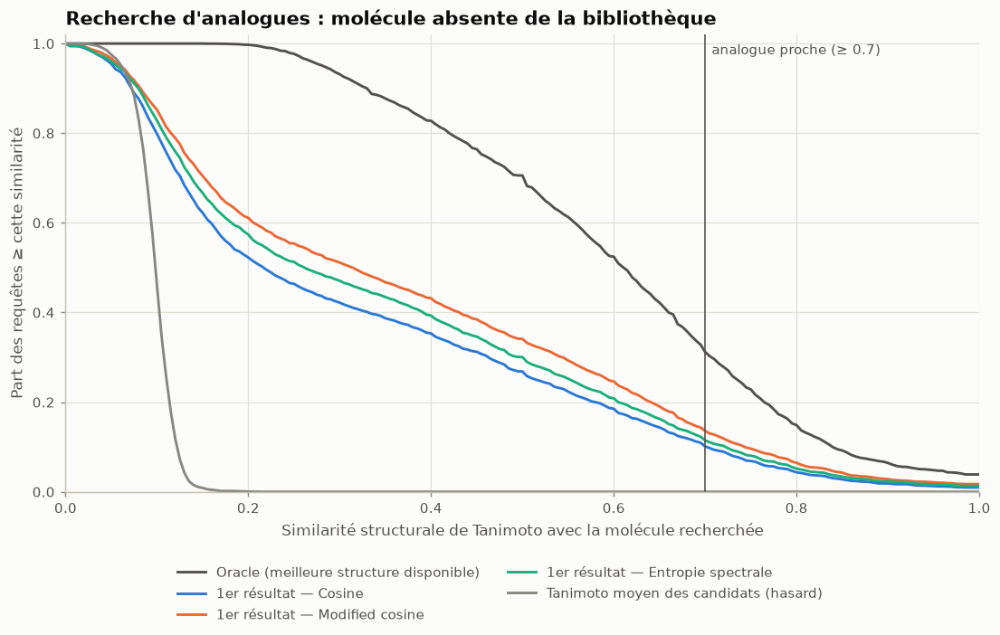
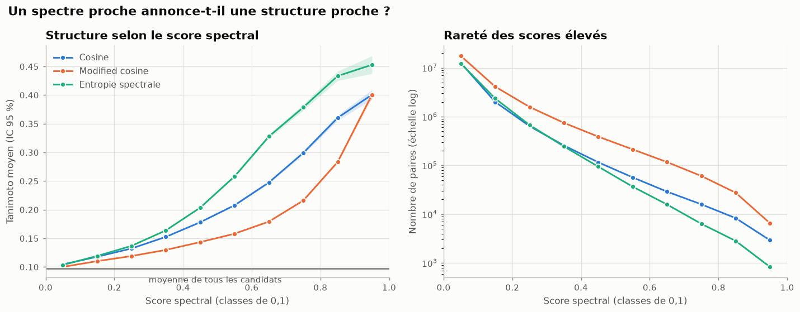
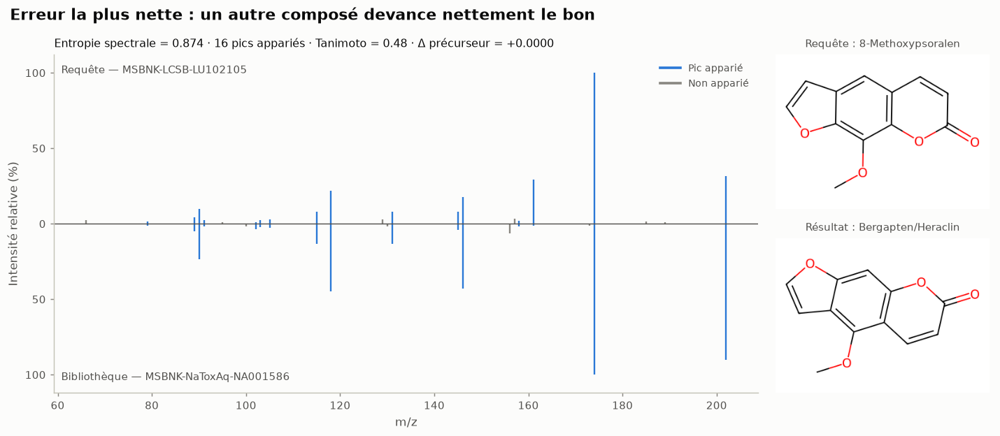
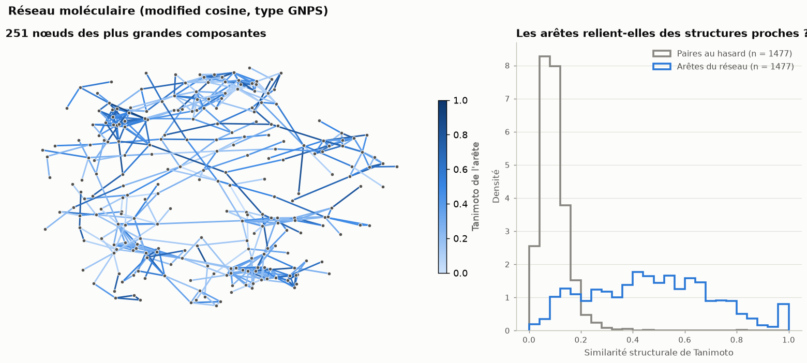

# msannot

**Identifier de petites molécules à partir de leur spectre de fragmentation (MS/MS), trouver des analogues structuraux quand elles sont inconnues, et mesurer honnêtement la fiabilité de ces annotations.**

[](https://github.com/narvall018/msannot/actions/workflows/ci.yml)


[](https://github.com/astral-sh/ruff)

[](LICENSE)

*English summary [at the end of this page](#english-summary).*

---

## En bref

| | |
|---|---|
| **Ce que fait le projet** | msannot compare un spectre MS/MS inconnu à une bibliothèque de spectres de référence, avec trois mesures de similarité : cosine, modified cosine et entropie spectrale. Il propose le composé le plus probable, ou des analogues structuraux, et **évalue** ces propositions sur 23 491 spectres publics de MassBank dont la structure est connue. |
| **Pourquoi** | En métabolomique et en analyse environnementale, la plupart des signaux mesurés restent non identifiés. La recherche en bibliothèque est la première étape d'annotation. Pourtant, sa fiabilité réelle est rarement mesurée dans des conditions réalistes : spectres d'autres laboratoires, isomères de même masse. |
| **Le tester** | `make install && source .venv/bin/activate && msannot demo` : environ une minute, données incluses. |
| **Ce qu'on obtient** | Des résultats de recherche (TSV + spectres miroirs), un rapport HTML autonome, 10 figures et un dashboard interactif. |



*Exemple réel, choisi automatiquement. Le N-oxyde de phéniramine est retiré de la
bibliothèque, puis recherché : le meilleur résultat est la phéniramine. L'écart de masse de
−15,995 Da correspond à un atome d'oxygène, et la similarité structurale (Tanimoto) est de 0,59.*

### Résultats clés

Évaluation complète, 25/09/2026 :

| Question | Résultat |
|---|---|
| Le bon composé est-il classé 1er, face à des **isomères de même masse**, à partir d'un spectre **d'un autre laboratoire** ? | **86,9 %** [IC 95 % : 86,0–87,8] (cosine), contre 51,5 % avec la masse seule |
| Quand la molécule est **absente**, le 1er résultat est-il un analogue proche (Tanimoto ≥ 0,7) ? | **13,9 %** (modified cosine), alors qu'un tel analogue existe pour 31,9 % des requêtes |
| L'entropie spectrale fait-elle mieux que le cosine ? | Un peu, au sein d'un même laboratoire (91,2 % contre 90,6 %, McNemar p = 3 × 10⁻⁷). **Pas de différence** entre laboratoires (p = 1,0) |
| Les arêtes d'un réseau moléculaire relient-elles des structures proches ? | Oui, bien plus que le hasard (Tanimoto médian 0,47 contre 0,09). Mais une arête sur six seulement relie des analogues proches |

---

## Sommaire

[Contexte](#contexte-scientifique) · [Objectifs](#objectifs) · [Fonctionnalités](#fonctionnalités) · [Démarrage](#démarrage-rapide) · [Utilisation](#exemples-dutilisation) · [Fonctionnement](#fonctionnement) · [Données](#données) · [Résultats](#résultats) · [Visualisations](#visualisations) · [Dashboard](#dashboard) · [Structure](#structure-du-dépôt) · [Technologies](#technologies) · [Tests](#tests-et-qualité) · [Reproductibilité](#reproductibilité) · [Limites](#limites) · [Roadmap](#roadmap) · [Compétences](#compétences-démontrées) · [Contribuer](#contribuer) · [Licence](#licence-et-citation)

## Contexte scientifique

En spectrométrie de masse en tandem (**MS/MS**), une molécule ionisée, le *précurseur*, est
fragmentée. Le spectre obtenu, c'est-à-dire la masse et l'intensité des fragments, est une
empreinte de sa structure. Pour annoter un spectre inconnu, on le compare aux spectres d'une
**bibliothèque** de molécules connues, comme MassBank, GNPS ou NIST.

Trois difficultés rendent cette tâche intéressante :

- **Les isomères** ont la même masse et parfois des fragments presque identiques. La masse
  seule ne suffit pas, et le spectre ne suffit pas toujours.
- **Les conditions d'acquisition varient** d'un laboratoire à l'autre (instrument, énergie
  de collision) : un même composé ne donne pas exactement le même spectre partout.
- **La plupart des molécules sont absentes** des bibliothèques. On cherche alors des
  *analogues* : le **modified cosine** apparie aussi les fragments décalés de la différence de
  masse, comme une méthylation (+14 Da) ou une oxydation (+16 Da).

## Objectifs

1. Implémenter les trois mesures de similarité de référence et les **valider** contre
   matchms et ms_entropy.
2. Construire un moteur de recherche **vectorisé** capable de comparer une requête à toute
   une bibliothèque.
3. Évaluer avec un protocole **réaliste** :
   - spectres d'autres laboratoires ;
   - isomères concurrents ;
   - molécule retirée de la bibliothèque ;
   - rang pessimiste en cas d'égalité ;
   - comparaison au hasard et à l'oracle.
4. Distinguer toujours le **technique**, le **statistique** et le **chimique**.
5. Livrer un logiciel testé, documenté et reproductible, fondé sur des données publiques
   correctement licenciées.

## Fonctionnalités

- **Données.** Téléchargement d'une version de MassBank, et licences de chaque spectre lues
  en flux dans l'export JSON-LD (plus de 500 Mo).
- **Curation avec RDKit.** SMILES valide, InChIKey cohérent, masse du précurseur conforme à
  la structure (10 ppm), molécule neutre. Chaque exclusion est comptée.
- **Nettoyage des spectres** : précurseur, bruit, nombre de pics.
- **Similarités** :
  - cosine et modified cosine gloutons, conventions identiques à matchms ;
  - **entropie spectrale pondérée** (Li et al., 2021), décomposée en somme sur les paires de
    pics.
- **Moteur de recherche vectorisé**, sur les fragments et les pertes neutres. Il est exact :
  écart inférieur à 10⁻¹⁵ avec les calculs paire par paire.
- **Recherche** en identification (fenêtre en ppm) ou en analogues (écart de masse).
- **Évaluation** :
  - top-1/3/10 avec IC de Wilson ;
  - scénario inter-laboratoires, sous-ensemble avec isomères ;
  - calibration des seuils de score, tests de McNemar ;
  - analogues face au hasard et à l'oracle, tests de Wilcoxon ;
  - relation spectre/structure (Spearman) et réseau moléculaire type GNPS.
- **Sorties** : TSV, JSON, spectres miroirs avec structures RDKit, rapport HTML autonome.
- **Interfaces** : CLI (`fetch`, `prepare`, `validate`, `search`, `benchmark`, `report`,
  `demo`), dashboard Streamlit et API Python.

## Démarrage rapide

```bash
git clone https://github.com/narvall018/msannot.git
cd msannot
make install                 # Python ≥ 3.11 ; RDKit s'installe via pip
source .venv/bin/activate
msannot demo                 # environ 1 minute → results/demo/report.html
```

Sans `make` : `pip install -e ".[app,dev,ref]"`. Avec Docker :
`docker build -t msannot . && docker run --rm msannot`.
Détails : [installation](docs/installation.md) · [démarrage](docs/quickstart.md).

## Exemples d'utilisation

```bash
# Identifier des spectres inconnus (MGF ou MSP)
msannot search data/demo/example_queries.mgf -l data/demo/massbank_open.msp.gz --metric entropy

# Chercher des analogues d'une molécule absente de la bibliothèque
msannot search mes_spectres.mgf -l data/demo/massbank_open.msp.gz --mode analog --metric modified_cosine

# Construire sa bibliothèque à partir de MassBank complet
msannot fetch --release 2026.03 && msannot prepare --msp data/raw/2026.03/MassBank_NISTformat.msp \
    --licenses data/raw/2026.03/MassBank.json -o data/processed/massbank.msp.gz

# Évaluation complète (toutes les requêtes, environ 3 min)
msannot benchmark config/full.yaml
```

```text
        MSBNK-ACES_SU-AS000913 — Caffeine (m/z 195.0873)
┃ rank ┃ name     ┃ score ┃ n_matches ┃ delta_mz ┃ contributor ┃
│ 1    │ Caffeine │ 0.951 │ 7         │ +0.0004  │ LCSB        │
│ 2    │ Caffeine │ 0.949 │ 7         │ +0.0004  │ Eawag       │
```

Référence complète : [docs/usage.md](docs/usage.md).

## Fonctionnement



1. **Curation.** Seuls les spectres MS2 [M+H]+ haute résolution, à structure valide et à
   précurseur cohérent avec la formule, sont conservés.
2. **Nettoyage.** Retrait du précurseur résiduel et du bruit.
3. **Index.** Tous les pics de la bibliothèque sont triés. Une requête trouve d'un coup ses
   pics correspondants par `searchsorted` ; le modified cosine utilise un second index, sur les
   pertes neutres.
4. **Scores.** Somme des contributions des paires appariées, avec un appariement glouton exact
   seulement quand un pic participe à plusieurs paires.
5. **Évaluation.** Protocoles décrits dans la [méthodologie](docs/methodology.md), avec
   références bibliographiques.

L'architecture logicielle (couches, points d'extension) est détaillée dans
[docs/architecture.md](docs/architecture.md).

## Données

**23 491 spectres MS/MS** de MassBank Europe (version 2026.03) : 3 958 composés,
24 laboratoires, instruments Orbitrap et QTOF. Seuls les spectres sous licence **CC BY 4.0**
ou **CC0** sont inclus. Le fichier compressé fait 4,9 Mo, et l'**attribution** de chaque
spectre est fournie. Trois spectres d'exemple servent de requêtes :
[docs/data.md](docs/data.md).

| Étape | Spectres |
|---|---|
| Export MassBank 2026.03 | 139 006 |
| MS2, mode positif, [M+H]+, haute résolution | 63 815 |
| Licence ouverte (CC BY 4.0, CC0) | 33 846 |
| Structure valide, précurseur cohérent, ≥ 5 pics | **23 494** (3 mis de côté comme requêtes d'exemple) |

## Résultats

Voici les résultats de l'évaluation complète (`config/full.yaml`). Ils sont déterministes.

| Identification (top-1) | Requêtes | Cosine | Entropie | Masse seule |
|---|---|---|---|---|
| Tous laboratoires | 22 258 | 95,9 % | 96,2 % | 81,5 % |
| Autres laboratoires | 13 709 | 94,5 % | 94,5 % | 79,7 % |
| Tous laboratoires, avec isomères concurrents | 9 640 | 90,6 % | 91,2 % | 57,4 % |
| **Autres laboratoires, avec isomères concurrents** | 5 727 | **86,9 %** | **86,9 %** | 51,5 % |

| Recherche d'analogues | Tanimoto médian du 1er résultat | 1er résultat proche (≥ 0,7) |
|---|---|---|
| Cosine | 0,216 | 10,4 % |
| **Modified cosine** | **0,314** | **13,9 %** |
| Entropie | 0,261 | 11,8 % |
| Hasard / oracle | 0,098 / 0,611 | 0,1 % / 31,9 % |

**Lecture à trois niveaux :**

- **Technique.** Trois mesures, plus de 22 000 requêtes d'identification et près de
  4 000 recherches d'analogues sont traitées en 3 min 15 s. Les similarités sont identiques à
  matchms (écart < 5 × 10⁻¹⁶ sur 12 000 paires).
- **Statistique.**
  - Sur l'ensemble des requêtes, la masse seule identifie déjà 80 % des composés : le chiffre
    global de 95 % surestime l'apport du spectre.
  - Sur les requêtes avec isomères, le spectre fait passer de 51 % à 87 %.
  - Changer de laboratoire coûte 4 points (intervalles disjoints).
  - L'avantage de l'entropie n'apparaît qu'au sein d'un même laboratoire.
- **Chimique (prudent).**
  - Le spectre discrimine la plupart des isomères, mais pas tous. Exemple : le
    8-méthoxypsoralène est confondu avec le bergaptène, un isomère de position.
  - Les meilleurs « analogues » spectraux sont rarement des analogues structuraux proches :
    une proposition d'analogue est une hypothèse. Toute annotation reste de niveau 2 de la
    Metabolomics Standards Initiative, et doit être confirmée par un standard.

Analyse détaillée, tests statistiques et limites : **[docs/results.md](docs/results.md)**.

## Visualisations

| | |
|---|---|
|  **Le bon composé est-il premier ?** Exactitude top-1 par mesure et par scénario, face au choix au hasard parmi les candidats de même masse. |  **Quel seuil de score choisir ?** Précision et couverture du 1er résultat : 95 % de précision au-delà de 0,85 (entropie), pour la moitié des requêtes. |
|  **Molécule absente : l'analogue proposé est-il proche ?** Part des requêtes selon la similarité structurale du 1er résultat, entre le hasard et l'oracle. |  **Un spectre proche annonce-t-il une structure proche ?** Oui, mais faiblement (ρ ≈ 0,12–0,15), et les scores élevés sont rares. |
|  **Limite de la MS/MS** : deux isomères de position (8-MOP et bergaptène) aux fragments quasi identiques. |  **Réseau moléculaire** : les arêtes relient des structures bien plus proches que le hasard. |

Les couleurs viennent d'une palette testée pour les principaux types de daltonisme ; chaque
mesure garde la même couleur dans toutes les figures.

## Dashboard

```bash
make run    # http://localhost:8501
```

Le dashboard a quatre onglets :

- **Recherche** : exemples, fichier importé ou pics collés ; résultats avec similarité de
  Tanimoto quand la structure de la requête est connue ; spectre miroir interactif selon le
  rang choisi ; structure proposée.
- **Bibliothèque** : composition et filtre par nom.
- **Benchmark** : résultats de `msannot demo`.
- **Méthode.**

Il ne contient aucune logique scientifique : il appelle l'API du package.

## Structure du dépôt

```
msannot/
├── src/msannot/
│   ├── io/              # MSP, MGF, MassBank (téléchargement, licences)
│   ├── chem/            # RDKit : structures, masses, empreintes, dessins
│   ├── processing/      # nettoyage des spectres, curation
│   ├── similarity/      # cosine, modified cosine, entropie ; index vectorisé
│   ├── search/          # SpectralLibrary : identification, analogues
│   ├── evaluation/      # identification, analogues, réseau, statistiques
│   ├── plotting/        # spectres miroirs, courbes, réseau
│   ├── report/          # rapport HTML (Jinja2)
│   ├── pipeline.py      # préparation, benchmark, exemples
│   └── cli.py           # interface en ligne de commande (Typer)
├── app/streamlit_app.py # dashboard (interface uniquement)
├── tests/               # 77 tests : unitaires, parité matchms/ms_entropy, intégration
├── config/              # demo.yaml, full.yaml, default.yaml (toutes les options)
├── data/demo/           # bibliothèque CC BY/CC0, attribution, requêtes d'exemple, SHA256SUMS
├── docs/                # installation, usage, architecture, données, méthodologie, résultats…
├── scripts/             # construction des données, validation des similarités, figures
├── .github/             # CI (lint, tests 3.11–3.13, démo, Docker), modèles d'issues
└── Dockerfile · Makefile · pyproject.toml · requirements.txt · .pre-commit-config.yaml
```

## Technologies

| Domaine | Outils |
|---|---|
| Chimio-informatique | **RDKit** (SMILES, InChIKey, masse exacte, empreintes de Morgan/ECFP4, Tanimoto, rendu 2D) |
| Spectrométrie de masse | formats MSP/MGF, cosine, modified cosine, entropie spectrale, réseau moléculaire ; matchms et ms_entropy comme références |
| Calcul et statistiques | numpy (index vectorisé), pandas, scipy : Wilson, McNemar exact, Wilcoxon, Spearman, Mann-Whitney, bootstrap |
| Graphes et visualisation | networkx, matplotlib, Streamlit |
| Logiciel | Python 3.11–3.13, Typer + Rich, pydantic v2, Jinja2, logging, pathlib |
| Qualité et reproductibilité | pytest, ruff, mypy, pre-commit, GitHub Actions, Docker, requirements.txt figé |

## Tests et qualité

```bash
make test      # 77 tests, moins d'une minute
make lint      # ruff + mypy
make coverage  # 93 %
```

- **Parité avec les références.**
  - Cosine et modified cosine identiques à **matchms** (0.31 et 0.33).
  - Entropie identique à **ms_entropy** quand l'appariement n'est pas ambigu ; les écarts
    restants ont été expliqués un par un.
- **Moteur vectorisé** égal aux fonctions de référence, y compris sur les cas de conflit.
  Un test a d'ailleurs révélé un vrai bogue, corrigé depuis : un score tronqué quand toutes
  les paires sont en conflit.
- **Protocoles d'évaluation** testés sur une bibliothèque jouet à la réponse connue (isomère
  concurrent, deux laboratoires).
- **Intégration** : benchmark réduit sur les vraies données, CLI (dont `search` sur les
  requêtes d'exemple) et dashboard (`streamlit.testing`).
- **CI** : lint et typage, tests sous Python 3.11, 3.12 et 3.13, démo complète (rapport en
  artefact) et image Docker.

## Reproductibilité

Données versionnées avec SHA-256 et gzip déterministe, version de MassBank fixée,
attribution des licences, graines fixes, rang pessimiste explicite, versions exactes
(`requirements.txt`), image Docker, et paramètres, versions et sommes de contrôle consignés
dans chaque rapport. Voir [docs/reproducibility.md](docs/reproducibility.md).

## Limites

- **Une seule bibliothèque**, MassBank en licence ouverte : les résultats ne se transposent
  pas tels quels à NIST, à GNPS ou à des spectres expérimentaux bruts.
- **La vérité de référence est l'annotation de la bibliothèque.** Des spectres identiques y
  portent parfois deux annotations différentes (55 cas détectés).
- **Stéréo-isomères confondus**, par construction (premier bloc de l'InChIKey).
- **Pas de données orthogonales** (temps de rétention, mobilité ionique) ni de
  similarités apprises (Spec2Vec, MS2DeepScore) dans cette version.
- **Mode positif, [M+H]+ et haute résolution uniquement.**

## Roadmap

- [ ] Similarités apprises (MS2DeepScore) dans le même protocole d'évaluation.
- [ ] Mode négatif et autres adduits ([M+Na]+, [M−H]−).
- [ ] Filtre par formule brute, isotopes et temps de rétention prédit, pour départager les
      isomères.
- [ ] Évaluation sur la bibliothèque MassBank complète (toutes licences, en local) et sur
      GNPS.
- [ ] Annotation de fichiers LC-MS/MS complets (mzML).
- [ ] Classes chimiques (NPClassifier, ClassyFire) pour analyser les erreurs par famille.

## Compétences démontrées

| Compétence | Où la voir |
|---|---|
| **Chimio-informatique** | RDKit : validation de structures, InChIKey, masses exactes et [M+H]+, empreintes de Morgan, Tanimoto, dessin de molécules |
| **Spectrométrie de masse** | formats MSP/MGF, nettoyage, cosine, modified cosine, entropie spectrale, réseau moléculaire, pertes neutres |
| **Algorithmique** | index vectorisé (`searchsorted`, pertes neutres, glouton exact ciblé), parité flottante stricte avec une référence |
| **Statistiques** | IC de Wilson, McNemar exact, Wilcoxon, bootstrap, Spearman, Mann-Whitney, calibration de seuils, références aléatoire et oracle |
| **Rigueur scientifique** | protocole inter-laboratoires, isomères concurrents, rang pessimiste, doublons exclus, validation contre des références, limites documentées |
| **Données publiques** | curation de MassBank, respect des licences (CC BY/CC0), attribution, provenance |
| **Python avancé** | package typé (mypy strict sur les définitions), dataclasses immuables, pydantic v2, séparation des couches |
| **Visualisation** | spectres miroirs avec structures, 10 figures justifiées, palette validée pour le daltonisme |
| **Tests** | 77 tests pytest, dont parité avec matchms et ms_entropy ; couverture de 93 % |
| **Automatisation, CI/CD** | CLI Typer, Makefile, GitHub Actions (matrice 3.11–3.13, démo, Docker) |
| **Reproductibilité** | versions figées, Docker, SHA-256, déterminisme, rapport traçable |
| **Documentation** | README, 9 documents dans `docs/`, docstrings NumPy en français, références bibliographiques |

*Voir aussi mon autre projet : [orfeval](https://github.com/narvall018/orfeval), sur la
prédiction de gènes procaryotes.*

## Contribuer

Voir [CONTRIBUTING.md](CONTRIBUTING.md) (environnement, conventions, ajout d'une mesure de
similarité), le [code de conduite](CODE_OF_CONDUCT.md) et la
[politique de sécurité](SECURITY.md).

## Licence et citation

Code sous licence [MIT](LICENSE). Les spectres de `data/demo/` restent sous leur licence
d'origine, **CC BY 4.0** ou **CC0 1.0**, avec l'attribution de chaque spectre dans
`data/demo/massbank_open.attribution.tsv.gz`. Pour citer le projet : [CITATION.cff](CITATION.cff).

---

## English summary

**msannot** annotates small molecules from their tandem mass spectra (MS/MS) by library
search, proposes structural analogues when the molecule is not in the library, and
**rigorously evaluates** both tasks on 23,491 openly licensed MassBank spectra with known
structures (RDKit).

- **Similarities.**
  - Greedy cosine and modified cosine, identical to matchms (< 5 × 10⁻¹⁶).
  - Weighted spectral entropy (Li et al., 2021), matching ms_entropy whenever peak assignment
    is unambiguous.
  - A vectorised, exact search engine indexes fragments and neutral losses.
- **Evaluation protocol.**
  - Cross-laboratory identification, and a subset with isomeric competitors.
  - Pessimistic tie ranking, exact duplicates excluded.
  - Analogue search with the query compound removed, compared with random and oracle
    baselines.
  - Wilson CIs, McNemar, Wilcoxon, Spearman, and a GNPS-like molecular network.
- **Results.**
  - Correct compound ranked first for **86.9 %** of cross-lab queries with isomeric
    competitors, versus 51.5 % for mass alone.
  - Entropy beats cosine only within a laboratory.
  - Modified cosine finds the best analogues, but only 13.9 % of first hits are close
    analogues (Tanimoto ≥ 0.7), while one exists in the library for 31.9 % of queries.
- **Engineering.** CLI, Streamlit dashboard, self-contained HTML report, 77 pytest tests,
  ruff and mypy, GitHub Actions (Python 3.11–3.13, end-to-end demo, Docker), pinned
  requirements.

```bash
git clone https://github.com/narvall018/msannot.git && cd msannot
make install && source .venv/bin/activate && msannot demo
```

Documentation is written in French; code identifiers are in English.
