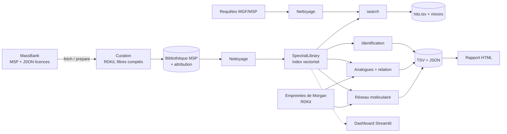
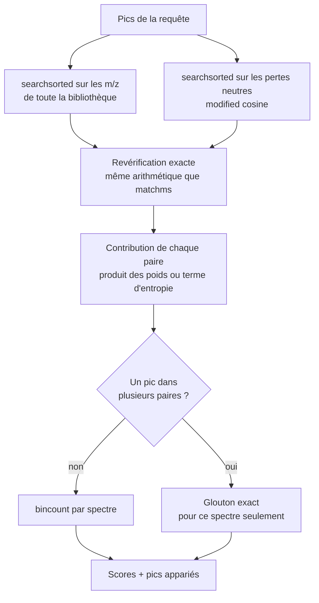

# Architecture

## Principes

1. **Couches séparées.** Similarités, recherche et évaluation ne dépendent ni des figures, ni
   du rapport, ni de la CLI, ni du dashboard.
2. **Implémentations de référence, puis optimisation.** Les similarités existent en version
   paire par paire (`similarity/pairwise.py`, lisible, validée contre matchms et ms_entropy)
   et en version vectorisée (`similarity/index.py`). Les tests imposent l'égalité des deux.
3. **Le rapport se reconstruit depuis les fichiers.** `report.build_report()` ne lit que
   `benchmark_summary.json` et les PNG : aucun chiffre ne peut y apparaître sans avoir été
   calculé.
4. **Données immuables.** `Spectrum` est figé, avec des tableaux numpy en lecture seule ; les
   configurations sont des modèles pydantic figés.
5. **Déterminisme.** Échantillonnages à graine fixe, tris stables, départage explicite des
   égalités.

## Flux de données

## Moteur de recherche

## Modules

| Module | Responsabilité |
|---|---|
| `models` | `Spectrum` : pics triés, métadonnées normalisées, immuable |
| `config` | configurations pydantic, chargement YAML, résolution des chemins |
| `io.msp`, `io.mgf` | lecture en flux, écriture (gzip déterministe) |
| `io.massbank` | téléchargement d'une version, licences lues en flux (JSON de 500 Mo) |
| `chem.structures` | RDKit : InChIKey, masse exacte, [M+H]+, empreintes, Tanimoto, dessins |
| `processing.cleaning` | nettoyage des spectres |
| `processing.curation` | curation d'un export, bilan des exclusions |
| `similarity.weights` | transformations d'intensité, entropie, contribution d'une paire |
| `similarity.pairwise` | similarités de référence, pics appariés (spectres miroirs) |
| `similarity.index` | moteur vectorisé sur toute une bibliothèque |
| `search.library` | `SpectralLibrary` : fenêtres de masse, recherche, doublons |
| `evaluation.identification` | protocole d'identification, calibration, McNemar |
| `evaluation.analogs` | analogues, relation spectre/structure |
| `evaluation.networking` | réseau moléculaire (networkx) |
| `evaluation.stats` | Wilson, McNemar, Wilcoxon, bootstrap, Spearman |
| `plotting.*` | figures (objets `Figure`, sans `pyplot`) |
| `report.builder` | rapport Jinja2, images en base64 |
| `pipeline` | préparation, benchmark, choix déterministe des exemples |
| `cli` | commandes Typer |

## Ajouter une mesure de similarité

Si la mesure se décompose en somme sur les paires appariées :

1. Écrire sa transformation d'intensité et sa contribution par paire dans `weights.py`.
2. L'ajouter au `Literal` `Metric` (`config.py`) et à `pairwise.similarity()`.
3. Brancher la contribution dans `LibraryIndex.query()`.
4. Ajouter un test d'égalité index/référence (paramétrage de `test_similarity.py`) et, si une
   implémentation de référence existe, un test de parité.

L'évaluation, les figures, le rapport et le dashboard l'intègrent automatiquement, car ils
itèrent sur `config.similarity.metrics`.

Une mesure non décomposable, comme une similarité apprise (Spec2Vec, MS2DeepScore),
s'ajouterait plutôt comme un nouveau type de `LibraryIndex` avec la même méthode `query()`.

## Choix techniques

| Choix | Raison |
|---|---|
| Implémentation propre des similarités | les comprendre, les valider (matchms, ms_entropy) et les vectoriser ; matchms reste une dépendance de test |
| Pertes neutres pour le modified cosine | le décalage varie d'un spectre à l'autre ; en pertes neutres, la condition devient une simple fenêtre |
| Rang pessimiste | les égalités de score sont fréquentes (spectres dupliqués) ; les départager en faveur de la méthode la flatterait |
| RDKit via PyPI | installation sans conda, image Docker légère |
| Licences lues en flux | l'export JSON fait plus de 500 Mo |
| gzip avec `mtime=0` | même contenu, même SHA-256 |
