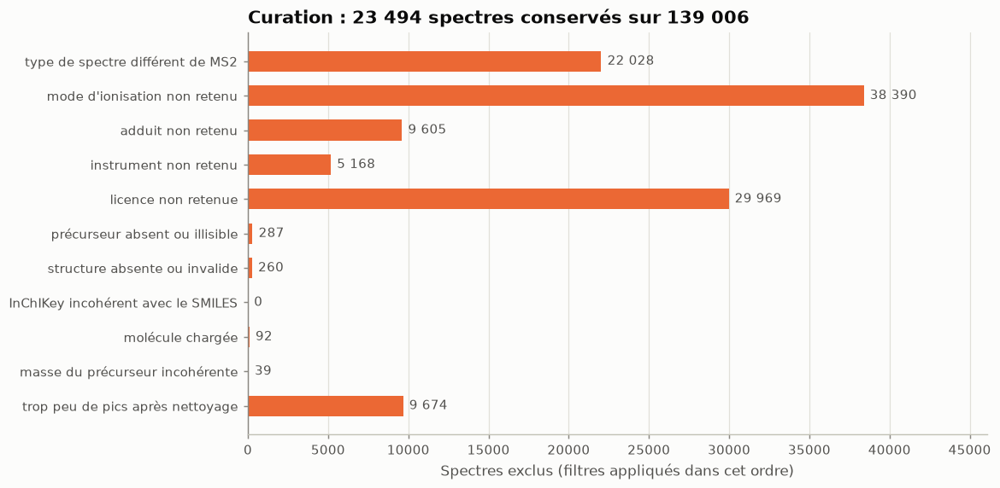
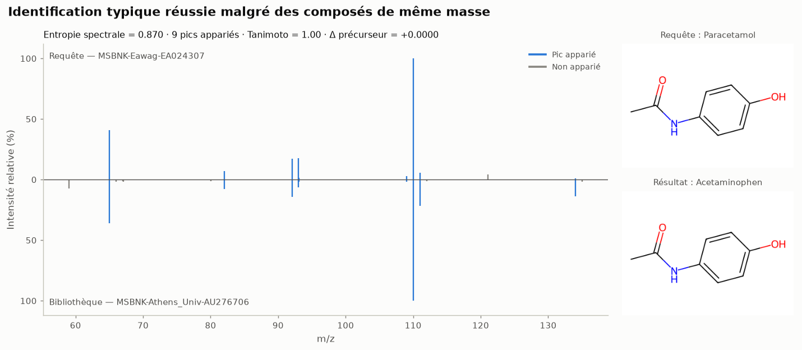

# Résultats

Évaluation complète : `msannot benchmark config/full.yaml`, avec msannot 0.1.0, RDKit
2026.03.6, numpy 2.5.3 et Python 3.12.3, exécutée le 25/09/2026 en 3 min 15 s. Le calcul est
déterministe. La démo (`msannot demo`) applique le même protocole à un échantillon de
requêtes, et donne des valeurs proches en une minute environ.

Chaque résultat est lu à trois niveaux : **technique** (ce que le code produit),
**statistique** (ce que mesurent les chiffres) et **chimique** (interprétation prudente).

## Jeu de données

| | |
|---|---|
| Spectres | 23 491 MS/MS, [M+H]+, haute résolution (Orbitrap/FT 70 %, QTOF/TOF 30 %) |
| Composés | 3 958 (premier bloc d'InChIKey) |
| Laboratoires | 24 contributeurs MassBank |
| Licences | CC BY 4.0 : 19 577 · CC0 : 3 914 |
| Qualité | 360 groupes de doublons exacts, dont 55 annotés comme des composés différents |

## 1. Identification : le composé est dans la bibliothèque

| Scénario | Requêtes | Cosine | Modified cosine | Entropie | Masse seule (hasard) |
|---|---|---|---|---|---|
| Tous laboratoires, toutes requêtes | 22 258 | 95,9 % | 95,9 % | 96,2 % | 81,5 % |
| Autres laboratoires, toutes requêtes | 13 709 | 94,5 % | 94,5 % | 94,5 % | 79,7 % |
| Tous laboratoires, **avec concurrents** | 9 640 | 90,6 % [90,0–91,2] | 90,6 % | 91,2 % [90,7–91,8] | 57,4 % |
| Autres laboratoires, **avec concurrents** | 5 727 | **86,9 %** [86,0–87,8] | 86,9 % | **86,9 %** [86,0–87,7] | 51,5 % |

*Exactitude top-1 : le bon composé est classé premier. Entre crochets, IC de Wilson à 95 %.*

**Technique.** 22 258 requêtes sont évaluées pour trois mesures et deux scénarios. Cosine et
modified cosine donnent des résultats identiques, ce qui est attendu : à précurseur égal, le
modified cosine se réduit au cosine. C'est aussi un contrôle de cohérence de
l'implémentation.

**Statistique.**

- **La masse seule donne déjà 80 %.** Sur l'ensemble des requêtes, un tirage au hasard parmi
  les candidats de même masse atteint environ 80 %, car la bibliothèque contient peu
  d'isomères. Le chiffre de 95 % surestime donc l'apport du spectre.
- **Sur les requêtes avec concurrents**, isomères ou isobares, le spectre fait passer de
  51,5 % (hasard) à 86,9 % en inter-laboratoires. Avec le cosine, le bon composé est dans
  les 3 premiers dans 93,6 % des cas, et dans les 10 premiers dans 98,8 %.
- **Le scénario inter-laboratoires est plus difficile** : 86,9 % contre 90,6 %, avec des
  intervalles disjoints.
- **Entropie contre cosine** (McNemar exact, requêtes avec concurrents) :
  - tous laboratoires : l'entropie fait mieux (96 requêtes gagnées contre 37, p = 3,2 × 10⁻⁷) ;
  - autres laboratoires : aucune différence (56 contre 57, p = 1,0).

**Chimique (prudent).** Le spectre de fragmentation discrimine nettement les isomères, mais
une erreur sur huit subsiste en conditions réalistes. L'avantage de l'entropie rapporté par
Li et al. (2021) n'apparaît ici qu'au sein d'un même laboratoire. Sur ce jeu de données, il
ne se retrouve pas entre laboratoires, où les différences d'instruments et d'énergies de
collision dominent. Cette observation porte sur une seule bibliothèque.

### Calibration : quel seuil de score ?

Scénario autres laboratoires, requêtes avec concurrents : pour obtenir **95 % de premiers
résultats corrects**, il faut un seuil de 0,90 en cosine (47 % des requêtes conservées) ou de
0,85 en entropie (50 % des requêtes conservées).

### Exemples, choisis automatiquement selon une règle fixe

**Réussite typique.** Paracétamol, identifié à partir d'un spectre d'un autre laboratoire.

**Erreur la plus nette.** Le 8-méthoxypsoralène (méthoxsalène) est confondu avec le
bergaptène (5-méthoxypsoralène). Ce sont des isomères de position, dont les fragments sont
presque identiques : 16 pics appariés, score de 0,87. C'est une limite intrinsèque de la
MS/MS, qu'aucune mesure de similarité ne peut lever seule. Le temps de rétention le
pourrait.

## 2. Recherche d'analogues : le composé est absent

| Méthode | Tanimoto médian du 1er résultat [IC 95 % bootstrap] | 1er résultat proche (≥ 0,7) [IC 95 %] |
|---|---|---|
| Cosine | 0,216 [0,204–0,227] | 10,4 % [9,5–11,4] |
| **Modified cosine** | **0,314** [0,292–0,329] | **13,9 %** [12,9–15,0] |
| Entropie | 0,261 [0,244–0,280] | 11,8 % [10,8–12,8] |
| Hasard (moyenne des candidats) | 0,098 | 0,09 % |
| Oracle (meilleure structure disponible) | 0,611 | 31,9 % |

*3 957 requêtes, une par composé.*

**Technique.** Pour chaque requête, tous les spectres du composé sont retirés, et les
candidats (20 030 en médiane) sont comparés par les trois mesures, en 2 min 15 s au total.

**Statistique.**

- Les trois mesures font bien mieux que le hasard (Wilcoxon, p < 10⁻³⁰⁰).
- Le modified cosine est la meilleure (p = 10⁻⁵⁰ contre le cosine, p = 4 × 10⁻¹⁵ contre
  l'entropie).
- Il reste loin de l'oracle : un analogue proche existe dans la bibliothèque pour 31,9 % des
  requêtes, mais il n'est classé premier que pour 13,9 % d'entre elles.

**Chimique (prudent).** Apparier les fragments décalés de la différence de masse aide
réellement à trouver des analogues structuraux : c'est le principe du réseau moléculaire.
Mais la majorité des « meilleurs analogues » spectraux restent éloignés structuralement. Une
proposition d'analogue est une piste, pas une identification.

*Le N-oxyde de phéniramine (requête) retrouve la phéniramine : l'écart de −15,9949 Da
correspond à un atome d'oxygène. Les fragments communs sont identiques, car le N-oxyde perd
son oxygène à la fragmentation.*

## 3. Un spectre proche annonce-t-il une structure proche ?

| Mesure | Paires (score > 0) | ρ de Spearman | Tanimoto moyen, score ≥ 0,9 |
|---|---|---|---|
| Cosine | 15,8 M | 0,125 | 0,401 (2 917 paires) |
| Modified cosine | 24,9 M | 0,117 | 0,401 (6 517 paires) |
| Entropie | 15,8 M | 0,152 | 0,453 (829 paires) |
| *Tous les candidats* | — | — | *0,097* |

**Statistique.** La relation est positive, mais faible (ρ ≈ 0,12 à 0,15). Le Tanimoto moyen
passe d'environ 0,10 pour les scores inférieurs à 0,1 à 0,40–0,45 pour les scores supérieurs
à 0,9, mais ces derniers sont rares : moins de 7 000 paires sur des millions. À score égal, le modified cosine désigne des structures un peu **moins**
proches que le cosine : ses appariements décalés gonflent aussi les scores de paires sans
rapport. Il reste pourtant le meilleur pour le **premier** résultat de la recherche
d'analogues.

**Chimique (prudent).** Ces résultats rejoignent le constat qui a motivé les similarités
apprises, comme Spec2Vec ou MS2DeepScore (Huber et al., 2021) : les similarités spectrales
classiques ne reflètent que partiellement la similarité structurale.

## 4. Réseau moléculaire

| | |
|---|---|
| Nœuds / arêtes | 3 958 / 1 477 |
| Nœuds connectés, composantes, plus grande composante | 1 172 · 269 · 152 nœuds |
| Tanimoto médian : arêtes / paires au hasard | **0,471** / 0,087 |
| Arêtes reliant des analogues proches (≥ 0,7) | 16,9 % [15,1–18,9] contre 0,07 % au hasard |

**Statistique.** Les arêtes relient des structures bien plus proches que le hasard (test de
Mann-Whitney, p < 10⁻³⁰⁰). Mais seule une arête sur six relie des analogues proches au sens
du seuil de 0,7.

**Chimique (prudent).** Le réseau regroupe bien des familles chimiques apparentées. Une arête
reste pourtant une hypothèse de parenté, pas une preuve.

## Ce que ces résultats ne montrent pas

- Les performances sur une autre bibliothèque (NIST, GNPS, MoNA) ou sur des spectres
  expérimentaux non curés.
- La supériorité d'une mesure en général : les différences observées sont faibles, et
  dépendent du scénario.
- La validité chimique d'une annotation : il faudrait un standard de référence et des
  données orthogonales.
